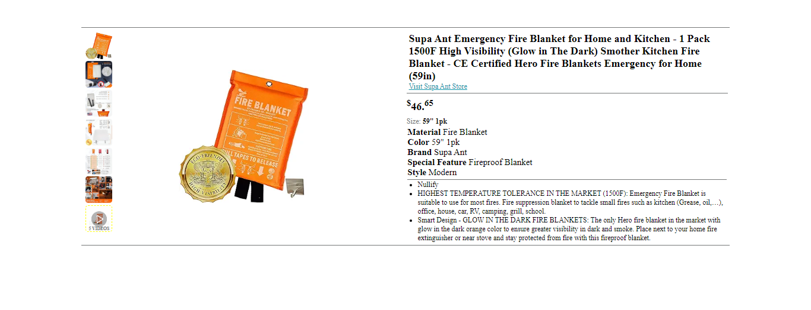

# Amazon Product Page - Supa Ant’s Emergency Fire Blanket

This project is a replica of an Amazon product page showcasing the "Supa Ant’s Emergency Fire Blanket for Home and Kitchen." The page includes product images, descriptions, and key features, using HTML and CSS to structure and style the content.

## Live Demo

[Click here to view the live demo](https://scrimba-horatio-amazon-product-page.netlify.app/)

## Screenshot

## Features

- **Product Images:** A section displaying multiple images of the fire blanket with hover effects on thumbnails.
- **Product Description:** Includes product details such as material, color, brand, and special features.
- **Responsive Design:** The page is designed to adapt to different screen sizes and devices.
- **Videos Section:** A placeholder for a video section with a unique hover effect and visual styling.

## Project Structure

- `index.html`: The main HTML file containing the product page structure.
- `styles.css`: The CSS file used for styling the product page.

## How to Use

1. Clone or download the repository.
2. Ensure that the image URLs are working or replace them with local image paths.
3. Open the `index.html` file in your web browser to view the product page.

## Sections

- **Product Images:** A list of clickable product images and a placeholder for product videos.
- **Product Heading:** The product name and a link to the Supa Ant store.
- **Product Description:** Price and detailed specifications of the fire blanket, including its size, material, and features.
- **Key Features:** Bulleted list highlighting the most important aspects of the product, such as fire resistance and smart design.

## Future Improvements

- Add functionality for video links to play actual product videos.
- Implement JavaScript to add interactivity such as image zoom or carousel for the product images.
- Include product reviews and ratings to mimic a more complete product page experience.

## Contributing

Feel free to submit pull requests to improve the design or functionality of this project.

## License

This project is open-source and available under the MIT License.
